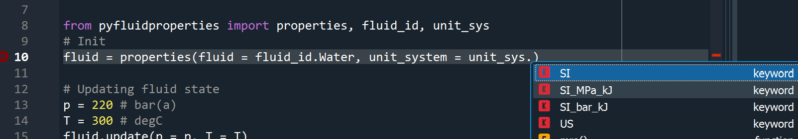
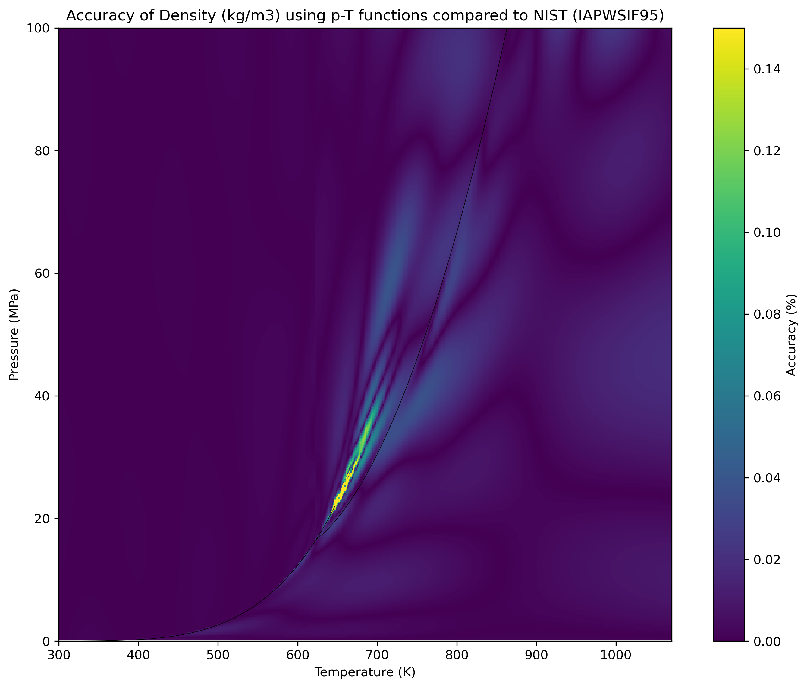
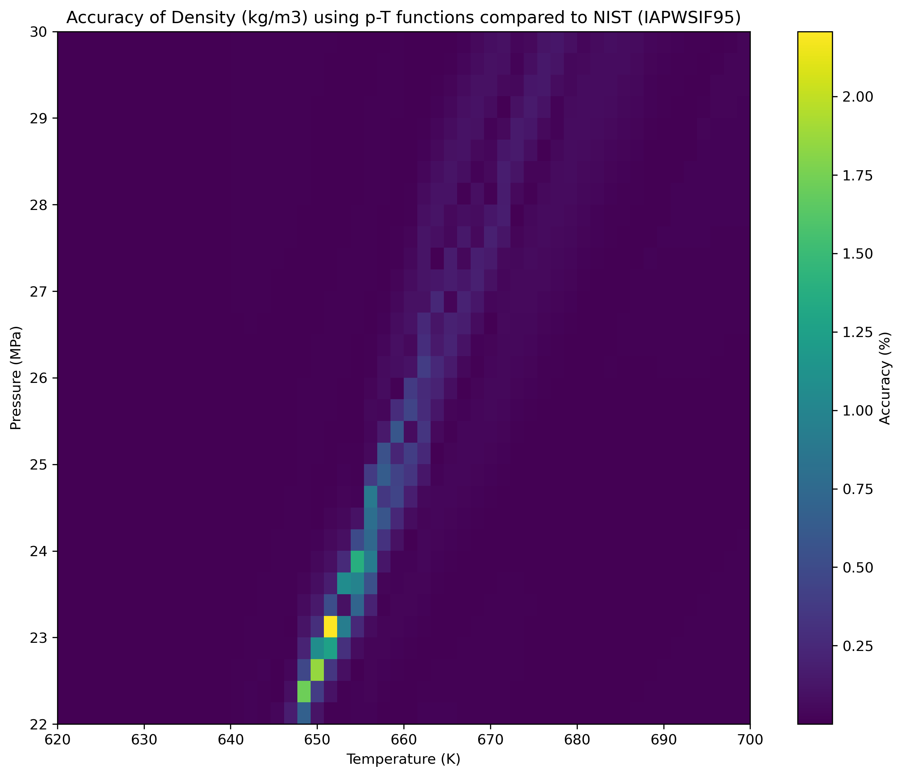
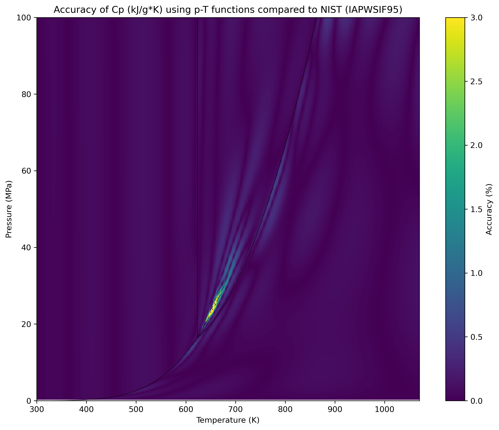
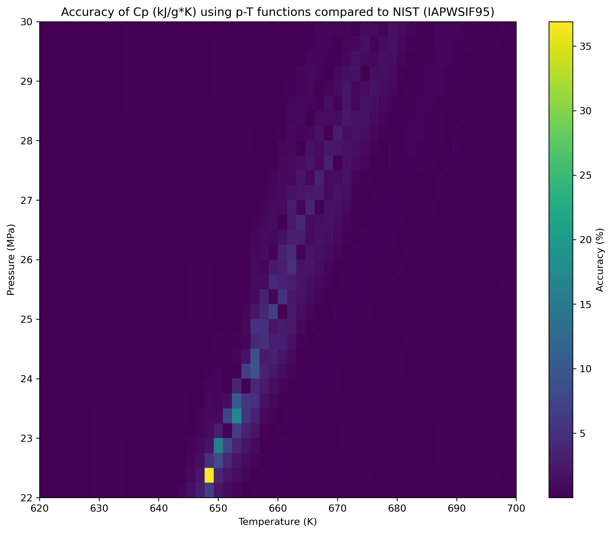

# pyfluidproperties
Thermodynamic properties of fluids in python
pyfluidproperties is a library of fluid properties for different fluids.

### Available fluids:
- Water (IAPWSIF-97 extended with SR2-01,SR3-03,SR4-04,SR5-05, R12-08, R15-11 etc.)

At the moment the only available fluid is water, but the aim is to extend the library with more fluids.
Ex. Nitrogen, Air, Hydrogen etc.

### Basic properties:
The following basic properties are available. 
Presented in SI-unit, other unit-systems are available, see "Unit-system" chapter.
| Description                       | Unit      | Letter    |
| ------                            | ------    | ------    |
|Pressure                           | Pa        | p         |
|Temperature                        | K         | T,t       |
|Specific Volume                    | m^3/kg    | v         |
|Density                            | kg/m^3    | rho       |
|Specific Enthalpy                  | J/kg      | h         |  
|Specific Internal Energy           | J/kg      | u         |
|Specific Entropy                   | J/kg/K    | s         |
|Specific Isobaric heat capacity    | J/kg/K    | cp        |
|Specific Isochoric heat capacity   | J/kg/K    | cv        |
|Speed of sound                     | m/s       | w         |
|Vapor mass fraction                | -         | x         |
|Dynamic Viscosity                  | Pa*s      | my        |
|Thermal Conductivity               | W/m/K     | tc        |
|Surface Tension                    | N/m       | st        |
   
## Usage
A short introduction to using pyfluidproperties.
### Installation
Install using pip:
```
$ pip install pyfluidproperties
```
or manually:
```
$ cd your_path\pyfluidproperties\
$ python setup.py install
```
### Workflow
##### Importing:
```
from pyfluidproperties import properties, fluid_id, unit_sys
```
##### Initializing:
```
# Initialize object by choosing fluid and unit-system
my_fluid = properties(fluid = fluid_id.Water, unit_sys = unit_sys.SI_MPa_kJ)
```
##### Update fluid state:
```
# p = 10 bar(a), T = 200 degC
my_fluid.update(p = 10, T = 200)
print(my_fluid)
```
##### Output:
```
Fluid:              Water (H2O)
Unit system:        SI_bar_kJ

Pressure            p =   10.000000  bar(a)
Temperature         T =  200.000000  degC

region =  2

Specific Volume                     v =      0.206004  m^3/kg
Specific Enthalpy                   h =   2828.267538  kJ/kg
Specific Internal Energy            u =   2622.263888  kJ/kg
Specific Entropy                    s =      6.695488  kJ/kg/C
Specific Isobaric heat capacity    cp =      2.428846  kJ/kg/C
Specific Isochoric heat capacity   cv =      1.752619  kJ/kg/C
Speed of sound                      w =    517.315611  m/s
Vapor mass fraction                 x =      1.000000  (-)
Dynamic Viscosity                  my =      0.000016  Pa*s
Thermal Conductivity               tc =      0.036312  W/m/K
Surface Tension                    st =           nan  N/m
```
##### Accessing properties
Accessing property value with: fluid_object.*, replace * with one of the basic property letters:
```
# Calculating dynamic pressure
v = 10 # m/s
p_dyn = 0.5*my_fluid.rho*v**2
```
##### Calculating a single property
Calculate and use single properties with ".get_*"-functions, just change * to one of the basic properties letters:
```
# Enthalpy for saturated steam at p = 5 bar(a)
h = my_fluid.get_h(p = 5, x = 1.0)
```

### Available functions
Use either as an object containing all the properties or access them individually using the provided .get_* functions. Each function should be called with two keywords/properties to define a fluid state. Valid combination depends on function, all possible combinations are presented for each function below.
##### Valid keywords/property
| Keyword  | Description|
| ------    | ------    |
|p          | Pressure  |
|T          | Temperature  |
|h          | Enthalpy  |
|x          | Mass fraction Steam  |
|rho          | Density  |
##### As and object, Calculate all properties at once
Update intialized object with all fluid properties for a new fluid state
*.update(kwargs).
###### Valid keyword-combinations
- Pressure - Temperature, p-T
- Pressure - Enthalpy, p-h
- Pressure - Entropy, p-s
- Enthalpy - Entropy, h-s
- Pressure - Mass fraction vapor, p-x
- Temperature - Mass fraction vapor, T-x

###### Ex:
```
my_fluid.update_pt(p = 5, h = 500)
```

##### .get_* functions, Calculate Individual properties

Calculate invidual properties using these functions and keyword combinations. 
For saturation properties use x = 0.0 for liquid and x = 1.0 for vapor.
| Function  | Description               | p-T   | p-h   | p-s   | p-rho | h-s   | p-x | T-x |
| ------    | ------                    | ---   | ---   | ---   | ---   | ---   | --- | --- |
|*.get_v    | Specific Volume           | x     | x     | x     | -     | x     | x | x  |
|*.get_h    | Enthalpy                  | x     | -     | x     | x     | -     | x | x |
|*.get_u    | Internal Energy           | x     | x     | x     | -     | x     | x | x  |
|*.get_s    | Entropy                   | x     | x     | -     | -     | x     | x | x  |
|*.get_cp   | Isobaric heat capacity    | x     | x     | x     | -     | x     | x | x  |
|*.get_cv   | Isochoric heat capacity   | x     | x     | x     | -     | x     | x | x  |
|*.get_w    | Speed of sound            | x     | x     | x     | -     | x     | x | x  |
|*.get_rho  | Density                   | x     | x     | x     | -     | x     | x | x  |
|*.get_my   | Dynamic Viscosity         | x     | x     | x     | -     | x     | x | x  |
|*.get_tc   | Thermal Conductivity      | x     | x     | x     | -     | x     | x | x  |
|*.get_st   | Surface Tension           | p     | T     | -     | -     | -     | - | - | 
|*.get_x    | Vapor mass fraction       | -     | x     | x     | -     | x     | - | -  |
|*.get_vx   | Vapor volume fraction     | -     | x     | x     | -     | x     | - | -  |
|*.get_T    | Temperature               | -     | x     | x     | -     | x     | x | -  |
|*.get_p    | Pressure                  | -     | x     | x     | -     | x     | - | x  |

###### Ex: Viscosity at 5 bar(a) and 500 kJ/kg

```
my = my_fluid.my(p = 5, h = 500)
```
##### Fluids and Unit systems 

Classes providing type-hints for available fluids and unit systems are available, just import 'fluid_id' and 'unit_sys' from pyfluidproperties
###### Ex:



##### Available unit systems

| Description                       | Unit      |  Unit         |  Unit     | Unit |
| ------                            | ------    | ------        | ------    | ------    |
| Unit-system                       | SI        |  SI_bar_kJ    |SI_MPa_kJ  | US        |
| Pressure                          | Pa        | bar(a)        | MPa       | psia
| Temperature                       | K         | C         | C         | F
| Specific Volume                   | m^3/kg    | m^3/kg    | m^3/kg    | ft^3/lbs
| Specific Enthalpy                 | J/kg      | kJ/kg     | kJ/kg     | Btu/lbm
| Specific Internal Energy          | J/kg      | kJ/kg     | kJ/kg     | Btu/lbm
| Specific Entropy                  | J/kg/K    | kJ/kg/C   | kJ/kg/C   | Btu/lbm/R
| Specific Isobaric heat capacity   | J/kg/K    | kJ/kg/C   | kJ/kg/C   | Btu/lbm/R
| Specific Isochoric heat capacity  | J/kg/K    | kJ/kg/C   | kJ/kg/C   | Btu/lbm/R
| Speed of sound                    | m/s       | m/s       | m/s       | ft/s
| Vapor mass fraction               | -         | -         | -         | -
| Dynamic Viscosity                 | Pa*s      | Pa*s      | Pa*s      | lb*s/ft^2
| Thermal Conductivity              | W/m/K     | W/m/K     | W/m/K     | Btu/h/ft/F
| Surface Tension                   | N/m       | N/m       | N/m       | lb/inch

###### Ex: Initializing Water with US-units:

```
my_fluid = properties(fluid = fluid_id.Water, unit_system = unit_sys.US)
```

### Verification, Validation and accuracy
Performed validations are described here. All validation tests can be found in the "validation"-folder of this repository. Calculated fluid states are compared to NIST-Webbook if available.
#### Water - IAPWSIF97

##### Verification

Water properties using IAPWIF97 is validated against verification-tables available in [IAPWSIF97-releases](http://iapws.org/release.html). All provided validation tables in used IAPWSIF-releases match calculated values with pyfluidproperties, with the following exceptions:  
- Viscosity: Tables with "critical enhancement" near the critical point. (Max 1.5%)
- Thermal Conductivity near the critical point. (Max 0.002%)

The difference is very small. The method for calculating Viscosity only provides verification-tables calculated with IAPWSIF95. pyfluidprop uses IAPWSIF97 which has lower accuracy compare to IAPWSIF95, this difference account for the majority of the deviation. The difference for Thermal conductivity is explaind by different methods for calculating the derivative $$\frac{\mathrm \partial \rho}{\mathrm \partial p}|_{\bar{T}}$$  

This comparison is done automatically with "validation/verification_iapws.py" where the excepted output is checked. Running this file is a god way of verify the installation.

##### Validation and accuracy

About 2200 fluid states spread out over the applicability range of IAPWSIF97, from 0.1 to 100 MPa and 300 to 2000 K, is compared to NIST (IAPWSIF95), the near critical region is excluded in this comparison. The maximum error for each property is calculated and presented below. 
| Input properties/combination  | $$T$$    | $$p$$    | $$\rho$$  | $$\nu$$	| $$u$$	   | $$h$$    | $$s$$    | $$C_v$$   | $$C_p$$   | $$w$$    | $$\mu$$   | $$\lambda$$   |
| ------                        |------|------|------|------|------|------|------|------|------|------|------|------|
| Pressure-Temperature (p-T)    |0.00 %|0.00 %|0.07 %|0.07 %|0.03 %|0.03 %|0.02 %|0.66 %|0.80 %|0.52 %|0.11 %|0.14 %|	
| Pressure-Enthalpy (p-h)       |0.02 %|0.00 %|0.07 %|0.07 %|0.08 %|0.08 %|0.08 %|0.67 %|0.76 %|0.55 %|0.12 %|0.13 %|
| Pressure-Entropy (p-s)        |0.02 %|0.00 %|0.07 %|0.07 %|0.04 %|0.03 %|0.04 %|0.67 %|0.76 %|0.57 %|0.14 %|0.13 %|
| Enthalpy-Entropy (h-s)        |0.02 %|1.75 %|0.09 %|0.09 %|0.08 %|0.00 %|0.00 %|0.67 %|0.84 %|0.60 %|0.14 %|0.14 %|
| Pressure - Mass fraction Vapor (p-x) x = 0.0|0.00 %|0.00 %|0.07 %|0.07 %|0.02 %|0.02 %|0.02 %|2.39 %|1.27 %|2.10 %|0.06 %|0.10 %|0.05 %	
| Pressure - Mass fraction Vapor (p-x) x = 1.0|0.00 %|0.00 %|0.12 %|0.12 %|0.04 %|0.04 %|0.03 %|0.59 %|0.80 %|0.11 %|0.01 %|0.31 %|
| Temperature - Mass fraction Vapor (T-x) x = 0.0|0.00 %|0.02 %|0.07 %|0.07 %|0.02 %|0.02 %|0.01 %|2.38 %|1.35 %|2.08 %|0.07 %|0.10 %|0.07 %|
| Temperature - Mass fraction Vapor (T-x) x = 1.0|0.00 %|0.02 %|0.15 %|0.15 %|0.04 %|0.05 %|0.04 %|0.58 %|0.82 %|0.11 %|0.01 %|0.32 %|

Accuracy data for all functions in the IAPWIF97 implementation, run "validation/validation_nist.py".

##### Heat maps

A even more comprehensive comparison to NIST-data has been performed. Where 250 000 fluid states evenly spread in the
range 300 K < T < 1070, 0.1< p < 100 MPa is calculated. A heat map for density ($$\rho$$)  and isobaric heat capacity ($$C_p$$)  .  
For heat maps for other properties, check [Validation-folder](https://github.com/ChristofferRa/pyfluidfroperties/tree/master/validation), to generate new heat maps use "validation\heat_map.py", fluid states to compare to have to be provided in csv-format.




